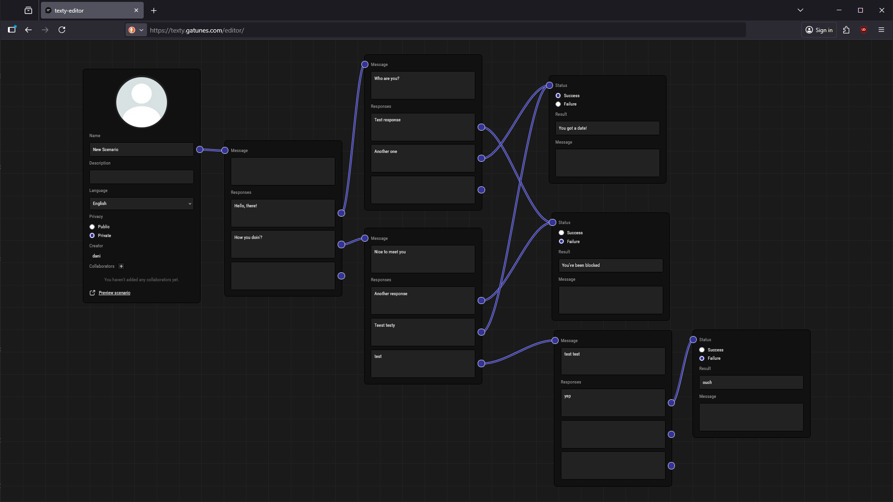

[texty](https://texty.gatunes.com/)
==

[](https://texty.gatunes.com/)

#### Local development

 * [MongoDB](https://mongodb.com/try/download/community) >= 8
 * [Node.js](https://nodejs.org/en/download) >= 22
 * [pNpm](https://pnpm.io/installation) >= 10

```bash
# clone this repo
git clone https://github.com/danielesteban/texty.git
cd texty
# install dependencies
pnpm -C editor install
pnpm -C game install
pnpm -C protocol install
pnpm -C server install
# build protocol
pnpm -C protocol build
# start the server dev environment:
pnpm -C server start
# start the editor dev environment:
pnpm -C editor start
# open http://localhost:8081/ in your browser
# start the game dev environment:
pnpm -C game start
# open http://localhost:8080/ in your browser
```

#### Production

##### docker compose

```yaml
services:
  client:
    image: ghcr.io/danielesteban/texty/client:master
    restart: always
    environment:
     - CLIENT=https://texty.gatunes.com/
     - EDITOR=https://texty.gatunes.com/editor/
     - SERVER=https://texty.gatunes.com/server/
    ports:
     - "127.0.0.1:8080:80"
  server:
    image: ghcr.io/danielesteban/texty/server:master
    restart: always
    environment:
     - ALLOWED_ORIGINS=https://texty.gatunes.com
     - MONGO_URI=mongodb://mongo/texty
     - SESSION_SECRET=randomsessionsecret
    ports:
     - "127.0.0.1:8081:80"
  mongo:
    image: mongo:8
    restart: always
    volumes:
     - "./volumes/config:/data/configdb"
     - "./volumes/data:/data/db"
```

##### nginx proxy

```nginx
server {
  listen 443 ssl;
  listen [::]:443 ssl;
  server_name texty.example.com;
  ssl_certificate /etc/letsencrypt/live/texty.example.com/fullchain.pem;
  ssl_certificate_key /etc/letsencrypt/live/texty.example.com/privkey.pem;

  location / {
    proxy_pass http://127.0.0.1:8080/;
    proxy_http_version 1.1;
    proxy_set_header Host $host;
  }

  location = /server {
    return 301 /server/;
  }

  location /server/ {
    proxy_pass http://127.0.0.1:8081/;
    proxy_set_header Host $host;
    proxy_set_header Upgrade $http_upgrade;
    proxy_set_header Connection "upgrade";
  }
}
```
